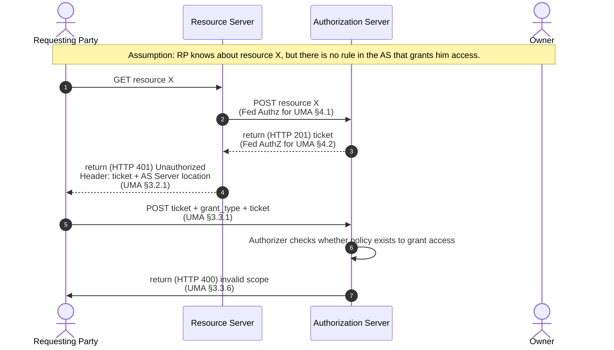

# Ucp pattern

A playground environment to calculate Access Modes based on ODRL Rules, an [UMA Client Request](https://docs.kantarainitiative.org/uma/wg/rec-oauth-uma-grant-2.0.html#rfc.section.3.3.1) and Koreografeye (with accompanying N3 Rules and plugin(s)).
This class will be used in the [UMA Authorisation Server](https://github.com/woutslabbinck/uma/packages/uma) that is being developed to work with the [Community Solid Server](https://github.com/CommunitySolidServer/CommunitySolidServer).

The UMA client request contains the following information
* Resource Owner
* Resource (the target resource)
* Requesting Party
* Requested Access Mode (decided by the Resource Server)

In [`main.ts`](./main.ts) is an example of how it works given.

## run

```sh
npx ts-node main.ts
```

## Info

Data usage (policy 1) plugin: `http://example.org/dataUsage`

## How does it work

There are a couple of components:
* Usage Control Rules storage: A storage containing instantiated concrete policies
* N3 Rules storage: A storage containing a set of N3 rules where each such rule matches a concrete type of UCP to the context. 
The result of which are a set of instructions for a **Koreografeye Plugin** .
* A Plugin storage: A storage containing a set Koreografeye Plugins. (note, they are a bit different than the koreografeye policies as they can return `any` instead of just `boolean`)
* An N3 Reasoner
* A Plugin Executor
* A UCP decision component: Which currently uses all of the above to **reason** over which **access modes** (actions) are granted based on a request.

This means that in an Authorization Server, this component could be used as a decision component.
```typescript
const ucpDecide: UconEnforcementDecision = ...
const accessModes = await ucpDecide.calculateAccessModes({
    subject: "https://woslabbi.pod.knows.idlab.ugent.be/profile/card#me",
    action: ["http://www.w3.org/ns/auth/acl#Read"],
    resource: "http://localhost:3000/test.ttl",
    owner: "http://localhost:3000/alice/profile/card#me"
});
console.log(accessModes);
```
```sh
> [ 'read' ]
```

### Next steps

* create architecture drawing of what it currently is capable of
* Integrate with [UMA server](https://github.com/SolidLabResearch/user-managed-access/)
  * Discuss with others



## TODOs

* handle prohibition
  * DECISION: future work: Policy management
* send notification to the owner that a request has been asked
  * maybe that should be handled in the Authorizer in the [UMA Authorisation Server](https://github.com/woutslabbinck/uma/packages/uma)
  * DECISION: future work
    * furthermore, this is resolved by adding an ODRL Rule to the rule set
* think about how to handle that a user has to wait for the owner
  * Maybe this is default in the [UMA Authorisation Server](https://github.com/woutslabbinck/uma/packages/uma) when no access modes are returned
  * DECISION: future work
  * current approach: Wait
* Define proper UCP plugin and use proper model for the uma context generated
  * that way proper N3 Rules for koreografeye can be written
* Code cleanups
* (optional) add a store to UcpPatternEnforcement to which other services could add extra ODRL Rules (would allow real use cases where an owner adds an ODRL Rule)
* What about exceptions
  * DECISION: future work 
  * iedereen heeft toegang. BEHALVE ...

### Demo

Write out flow described here


This needs to be the end goal of a UMA Solid Demo with following reqs:
* Uses ODRL Rules to dictate Usage Control
* RO can add ODRL Rules to the AS

extra reqs (as can be seen in figure): use LDN inbox for the messages.

