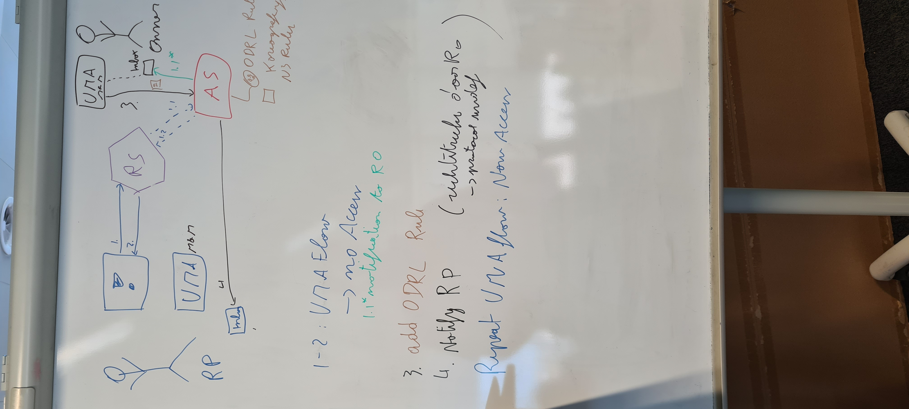
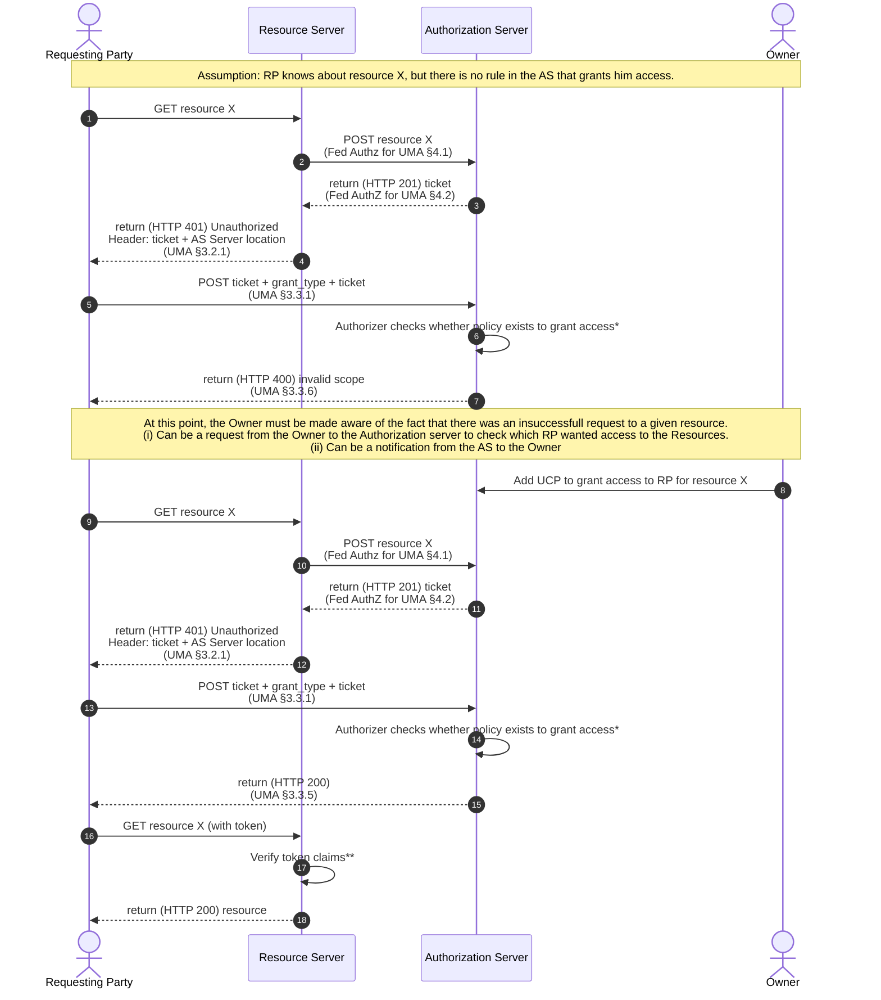

## Brakke demo

Started at 27-10-2023

## Demo

Write out flow described here

This needs to be the end goal of a UMA Solid Demo with following reqs:
* Uses ODRL Rules to dictate Usage Control
* RO can add ODRL Rules to the AS

extra reqs (as can be seen in figure): use LDN inbox for the messages.

### Sequence diagram

\*: The authorizer here would use an instantiation of interface `UconEnforcementDecision` to `calculateAccessModes` for the given `request` against the stored `Usage Control Rules` (and how those rules should be interpreted -> `N3 Rules`)

\**: The verification of the token can include sending requests to the Authorization Server and other services. Only if they are valid, can the request be granted. 

## TODOs | requirements

* handle prohibition
  * DECISION: future work: Policy management
* send notification to the owner that a request has been asked
  * maybe that should be handled in the Authorizer in the [UMA Authorisation Server](https://github.com/woutslabbinck/uma/packages/uma)
  * DECISION: future work
    * furthermore, this is resolved by adding an ODRL Rule to the rule set
* think about how to handle that a user has to wait for the owner
  * Maybe this is default in the [UMA Authorisation Server](https://github.com/woutslabbinck/uma/packages/uma) when no access modes are returned
  * DECISION: future work
  * current approach: Wait
* Define proper UCP plugin and use proper model for the uma context generated
  * that way proper N3 Rules for koreografeye can be written
* Code cleanups
* (optional) add a store to UcpPatternEnforcement to which other services could add extra ODRL Rules (would allow real use cases where an owner adds an ODRL Rule)
* What about exceptions
  * DECISION: future work 
  * iedereen heeft toegang. BEHALVE ...